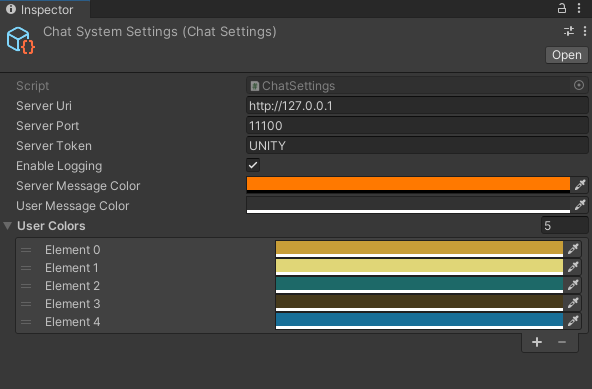

# ChatSystem for Unity

## Features

- Connects to a self-hosted server: see [Unity Socket IO Server](https://github.com/clandais/Unity-Socket-IO-Server/tree/main)
- Create a **room** and join it
- Send and receive messages in real-time from the "general" room and the created room 

## Installation

### Unity Package Manager

Using the Unity Package Manager, click on the cross on the top left corner and select "Add package from git URL..." and paste the following URL: `https://github.com/clandais/Unity-Socket-IO-Network.git?path=/Assets/ChatSystem`

  

From here, you can import a sample scene.

## Start using it

### Create the ChatSettings

- create a `Resources` folder in your `Assets` folder.
- right click on the `Resources` folder and select `Create/Klem/ChatSystem/ChatSettings`
- The parameters are as follow:
  - `Server Uri`: the URL of the server you want to connect to. For example: `http://127.0.0.1`
  - `Server Port`: the port of the server you want to connect to. For example: `11100`
  - `Server Token`: the token used by the server. For example: `UNITY`.
  - `Enable Logging`: if checked, the logs will be displayed in the console.
  - `Server Message Color`: the color of the messages sent by the server.
  - `User Message Colors`: a list of colors that will be picked randomly for the user names.

  

### Connecting to the server

`SocketIONetwork` is a static class with an API similar to Photon PUN (2).
A good starting point would be to, first, set the user's name and then connect (not mandatory).

```csharp
SocketIONetwork.User.Username = usernameInput.text;

// this will connect to the server using the first ChatSettings ScriptableObject found in any Resource folder
await SocketIONetwork.Connect();
```

You can, then, start to use the `SocketIONetwork` API and the classes extending `MonobehaviourSocketCallbacks` will start to recieve their callbacks.