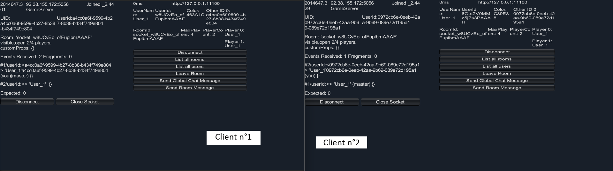

# Pairing with Photon (PUN)

## Quick example

Create two GameObjects in your scene.
- On the first one, drag and drop the script found in Photon/PhotonUnityNetworking/UtilityScripts/Debugging/StatesGui.cs. This will allow you to see the state of the Photon connection in the Unity Editor.
- On the second one, add the component `Klem > SocketChat > Debugging > StatesGui`. This will allow you to see the state of the SocketIO connection in the Unity Editor.

Let's create two scripts: `ChatRoomCreation` and `PhotonRoomCreation`. Drag and drop them on the same GameObject.

```csharp
public class ChatRoomCreation : MonoBehaviourSocketCallBacks
{
    private PhotonRoomCreation _photonRoomCreation;

    private const int PhotonIdIndex = 0;
    
    private void Start()
    {
        _photonRoomCreation = GetComponent<PhotonRoomCreation>();
        _photonRoomCreation.OnPhotonConnectedToMaster.AddListener(OnPhotonConnectedToMaster);
        _photonRoomCreation.OnPhotonLeftRoom.AddListener(OnPhotonLeftRoom);
    }

    private void OnDestroy()
    {
        _photonRoomCreation.OnPhotonConnectedToMaster.RemoveListener(OnPhotonConnectedToMaster);
        _photonRoomCreation.OnPhotonLeftRoom.RemoveListener(OnPhotonLeftRoom);
    }
    
    private Room _room;


    /// <summary>
    ///  We have joined a SocketIO room, now we need to connect to Photon
    /// </summary>
    public override void OnRoomJoined(Room obj)
    {
        _room = obj;
        _photonRoomCreation.ConnectToPhoton();
    }

        /// <summary>
    ///  Now that we are connected to Photon, we can create or join a room
    /// </summary>
    /// <param name="photonId"></param>
    private async void OnPhotonConnectedToMaster(string photonId)
    {
        Debug.Log($"Connected to Photon, with id {photonId}" , gameObject);
        
        // update the user with the PhotonId
        // The SocketIOUser class has a list of otherIds, we can use it to store the PhotonId
        SocketIONetwork.User.OtherIds.Insert(PhotonIdIndex, photonId);
        SocketIONetwork.UpdateUser();
        
        Debug.Log( $"Our room has : {_room.PlayerCount} players", gameObject);

        // We are the first player in the room, we need to create a room in Photon
        if (_room.PlayerCount == 1)
        {
            _photonRoomCreation.CreatedRoom(_room);
        }
        // We are not the first player in the room, we need to join a room in Photon
        else if (_room.PlayerCount > 1)
        {
            _photonRoomCreation.JoinRoom(_room);
        }
        else
        {
            Debug.LogError("Room has no players", gameObject);
        }
    }
    
    /// <summary>
    ///  We have left a a Photon room, now we need to leave the SocketIO room
    /// </summary>
    private async void OnPhotonLeftRoom()
    {
        await SocketIONetwork.LeaveRoom();
    }

    /// <summary>
    ///  We have left a SocketIO room, now we need to disconnect from Photon
    /// </summary>
    public override void OnRoomLeft(Room room)
    {
        _photonRoomCreation.Disconnect();
    }

    /// <summary>
    ///  We have disconnected from the SocketIO room, now we need to disconnect from Photon
    /// </summary>
    public override void OnDisconnecting(string reason)
    {
        _photonRoomCreation.Disconnect();
    }
}
```
    
```csharp
///<summary>
/// This one should be pretty straightforward
///</summary>
public class PhotonRoomCreation : MonoBehaviourPunCallbacks
{
    public UnityEvent<string> OnPhotonConnectedToMaster;
    public UnityEvent OnPhotonLeftRoom;
    

    public void ConnectToPhoton()
    {
        if (PhotonNetwork.IsConnected)
        {
            Debug.Log("Already connected to Photon", gameObject);
            return;
        }

        PhotonNetwork.ConnectUsingSettings();
    }


    public void Disconnect()
    {
        PhotonNetwork.Disconnect();
    }
    
    public override void OnConnectedToMaster()
    {
        OnPhotonConnectedToMaster.Invoke(PhotonNetwork.LocalPlayer.UserId);
        PhotonNetwork.NickName = SocketIONetwork.User.Username;
    }

    public override void OnLeftRoom()
    {
        OnPhotonLeftRoom.Invoke();
    }

    public void CreatedRoom(Room room)
    {
        PhotonNetwork.CreateRoom(room.Name, new RoomOptions()
        {
            MaxPlayers = room.MaxPlayers,
        });
    }
    
    
    public void JoinRoom(Room room)
    {
        PhotonNetwork.JoinRoom(room.Name);
    }
}
```

Obviously, this is a very simple example. You might want to add more check, error handling and setup a messagge channel between the two systems. But it should give you a good starting point.

With the help of `ParallelSync`, you can qucikly test your setup and see if everything is working as expected.

